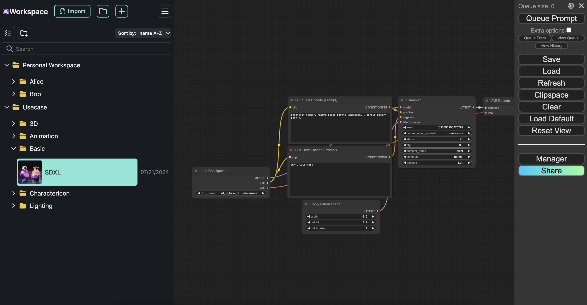
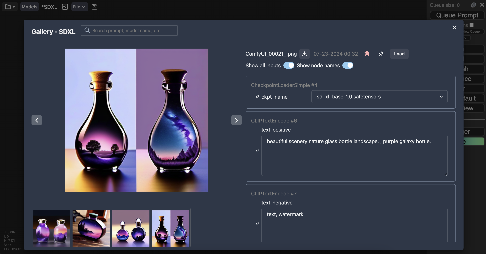

# ComfyUI on AWS

[](https://opensource.org/licenses/MIT)

This sample repository provides a seamless and cost-effective solution to deploy ComfyUI, a powerful AI-driven image generation tool, on AWS. This repository provides a comprehensive infrastructure code and configuration setup, leveraging the power of ECS, EC2, and other AWS services. Experience a hassle-free deployment process while enjoying uncompromised security and scalability.

💡 Note: this solution will incur AWS costs. You can find more information about it in the costs section.




## Solution Features

1. **Effortless Deployment** 🚀: Harness the power of [Cloud Development Kit (CDK)](https://aws.amazon.com/cdk/) for a streamlined and automated deployment process.
2. **Cost Optimization** 💰: Leverage cost-saving options like Spot Instances, Automatic Shutdown, and Scheduled Scaling to maximize your budget efficiency.
3. **Robust Security** 🔒: Enjoy peace of mind with robust security measures, including Authentication (with SAML such as Microsoft Entra ID / Google Workspace), Email Domain Restriction, IP Restriction, Custom Domain SSL, Security Scans, etc.

## Architecture Overview


## Services

- **[Amazon VPC](https://docs.aws.amazon.com/vpc/latest/userguide/what-is-amazon-vpc.html)** - A VPC with public and private subnets is created to host the ECS cluster
- **[ECS Cluster](https://docs.aws.amazon.com/AmazonECS/latest/developerguide/clusters.html)** - An ECS cluster is created to run the ComfyUI task
- **[Auto Scaling Group](https://docs.aws.amazon.com/autoscaling/ec2/userguide/auto-scaling-groups.html)** - An ASG is created and associated with ECS as a capacity provider. It launches GPU instances to host ECS tasks.
- **[ECS Task Definition](https://docs.aws.amazon.com/AmazonECS/latest/developerguide/task_definitions.html)** - Defines the ComfyUI container and mounts EBS volume for persistence
- **[ECS Service](https://docs.aws.amazon.com/AmazonECS/latest/developerguide/ecs_services.html)** - Creates an ECS service to run the ComfyUI task definition
- **[Application Load Balancer](https://docs.aws.amazon.com/elasticloadbalancing/latest/application/introduction.html)** - An ALB is setup to route traffic to the ECS service 
- **[Log Bucket](https://docs.aws.amazon.com/elasticloadbalancing/latest/application/load-balancer-access-logs.html)** - An S3 bucket stores ALB access logs 
- **[Amazon ECR](https://docs.aws.amazon.com/AmazonECR/latest/userguide/what-is-ecr.html)** - Holds the ComfyUI Docker image
- **[CloudWatch Log Group](https://docs.aws.amazon.com/AmazonCloudWatch/latest/logs/Working-with-log-groups-and-streams.html)** - Stores logs from the ECS task
- **[Amazon Cognito](https://docs.aws.amazon.com/cognito/latest/developerguide/cognito-user-identity-pools.html)** - User directory for having authentication in front of the ALB
- **[AWS WAF](https://docs.aws.amazon.com/waf/latest/developerguide/waf-chapter.html)** - Block access by IP
- **[AWS Lambda](https://docs.aws.amazon.com/lambda/)** - To manage ComfyUI state

## Getting Started

#### Prepare the AWS environment

For the sake of reproducability and consistency, we recommend using [AWS Cloud9](https://docs.aws.amazon.com/cloud9/latest/user-guide/welcome.html) IDE for deploying and testing this solution.

!!! info 
    You can use your local development environment, but you will need to make sure that you have AWS CLI, AWS CDK and Docker properly setup. Additionally, if you're building your docker image using apple chips (M1, M2, etc.) then you need to use the Docker ```docker build --platform linux/amd64 .``` command.

<details>
<summary>Click to see environment setup with Cloud9</summary>

1. Login to AWS Console
2. Navigate to Cloud9
3. Create Environment with following example details:
    - Name: Give your Dev Environment a name of choice
    - Instance Type: t2.micro (default) got a free-tier
    - Platform: Ubuntu Server 22.04 LTS
    - Timeout: 30 minutes
    - Other settings can be configured with the default values
4. Create and open environment
5. resize disk space
    ```bash
    curl -o resize.sh https://raw.githubusercontent.com/aws-samples/semantic-search-aws-docs/main/cloud9/resize.sh
    chmod +x ./resize.sh
    ./resize.sh 100
    ```
6. git clone <enter this repo URL here>
7. cd into new directory
</details>

<details>
<summary>Click to see environment setup with Local environment</summary>

If you're not using Cloud9, then make sure that you execute the following commands on your local environment:

```bash
aws configure
```

When prompted, enter your AWS Access Key ID, Secret Access Key, and then the default region name (eg. us-east-1). You can leave the output format field as default or specify it as per your preference.

You can change the used AWS account and region by setting the env variables below. You can also define the ECR repository name. These variables will be used in many of the commands below.

```bash
export AWS_DEFAULT_REGION=<aws_region> # e.g. "us-east-1", "eu-central-1"
export AWS_DEFAULT_ACCOUNT=<your_account_id> # e.g. 123456789012
export ECR_REPO_NAME="comfyui"
```
</details>

#### Build & push docker image to ECR

You could build & reference your docker image in CDK directly, but we're using docker build and push the image to ECR, that we don't need to build the docker image with every CDK deployment. Additionally, the image is getting scanned
for vulnerabilites as soon as you push the image to ECR. You can achieve this as following:

1. Create an ECR repository and login
```
aws ecr create-repository --repository-name $ECR_REPO_NAME --image-scanning-configuration scanOnPush=true
```
2. Login to ECR
```
aws ecr get-login-password --region $AWS_DEFAULT_REGION | docker login --username AWS --password-stdin $AWS_DEFAULT_ACCOUNT.dkr.ecr.$AWS_DEFAULT_REGION.amazonaws.com/$ECR_REPO_NAME
```
3. Build docker image (make sure you're in the same directory as your dockerfile)
```
docker build -t comfyui .
# or alternatively if you are using M1 / M2 / ... Mac
docker build --platform linux/amd64 -t comfyui .
```
4. Tag and push docker image to ECR
```
docker tag comfyui:latest $AWS_DEFAULT_ACCOUNT.dkr.ecr.$AWS_DEFAULT_REGION.amazonaws.com/$ECR_REPO_NAME:latest
docker push $AWS_DEFAULT_ACCOUNT.dkr.ecr.$AWS_DEFAULT_REGION.amazonaws.com/$ECR_REPO_NAME:latest
```

#### Deploying ComfyUI

1. (First time only) Install Required Dependency
```python
python -m pip install -r requirements.txt
```
2. (First time only) If you use CDK in your first time in an account/region, then you need to run following command to bootstrap your account. For subsequent deployments this step is not required anymore
```bash
cdk bootstrap
```
3. Deploy ComfyUI to your default AWS account and region
```bash
cdk deploy
```

Depending on your custom_nodes and extenstions in the dockerfile, the deployment will take approx. 8-10 minutes to have ComfyUI ready
 
 ```
 ✅  ComfyUIStack

✨  Deployment time: 579.07s

Outputs:
ComfyUIStack.CognitoDomainName = comfyui-alb-auth-XXXXXXX
ComfyUIStack.Endpoint = ComfyUiALB-XXXXX.uw-west-2.elb.amazonaws.com
ComfyUIStack.UserPoolId = us-west-2_XXXXXXX
Stack ARN:
arn:aws:cloudformation:[us-east-1]:[your-account-id]:stack/ComfyUIStack/[uuid]

✨  Total time: 582.53s
```

You can access application from output value of `ComfyUIStack.Endpoint`.

#### Uploading models

1. You can install models, loras, embedding, controlnets over ComfyUI-Manager or other extension (custom node). See [User Guide](docs/USER_GUIDE.md#model-installation) for detail.
2. You can extend (optional) and execute the upload script in this repo with a preselected list of models, controlnets etc. If the SSM command is not working, make sure that the role you are using is allowed to access the EC2. You'll find some additional examples in the `/scripts/upload_models.sh` file.

```bash
# 1. SSM into EC2
aws ssm start-session --target "$(aws ec2 describe-instances --filters "Name=tag:Name,Values=ComfyUIStack/ASG" "Name=instance-state-name,Values=running" --query 'Reservations[*].Instances[*].[InstanceId]' --output text)" --region $AWS_DEFAULT_REGION

# 2. SSH into Container
container_id=$(sudo docker container ls --format '{{.ID}} {{.Image}}' | grep 'comfyui:latest$' | awk '{print $1}')
sudo docker exec -it $container_id /bin/bash

# 3. install models, loras, controlnets or whatever you need (you can also include all in a script and execute it to install)

# FACE SWAP EXAMPLE Upscaler - https://huggingface.co/ai-forever/Real-ESRGAN
wget -c https://huggingface.co/ai-forever/Real-ESRGAN/blob/main/RealESRGAN_x2.pth -P ./models/upscale_models/
```

#### User Guide

To unlock the full potential of ComfyUI and ensure a seamless experience, explore our detailed [User Guide](docs/USER_GUIDE.md). This comprehensive resource will guide you through every step, from installation to advanced configurations, empowering you to harness the power of AI-driven image generation with ease.

- [Installing Extensions (Custom Nodes)](docs/USER_GUIDE.md#installing-extensions-custom-nodes)
    - [Recommended Extensions](docs/USER_GUIDE.md#recommended-extensions)
        - [ComfyUI Workspace Manager](docs/USER_GUIDE.md#comfyui-workspace-manager)
- [Installing Models](docs/USER_GUIDE.md#installing-models)
    - [Using ComfyUI-Manager](docs/USER_GUIDE.md#using-comfyui-manager)
    - [Using Other Extensions](docs/USER_GUIDE.md#using-other-extensions)
    - [Manual Installation](docs/USER_GUIDE.md#manual-installation)
- [Running a Workflow](docs/USER_GUIDE.md#running-a-workflow)

#### Deploy Option

With our comprehensive Deploy Options, you have the power to craft a tailored solution that aligns perfectly with your security requirements, and budget constraints. Unlock the full potential of ComfyUI on AWS with unparalleled flexibility and control.You can enable following features with just few steps.

- [Configuration Method](docs/DEPLOY_OPTION.md#configuration-method)
    - [How to Change Values in cdk.json](docs/DEPLOY_OPTION.md#how-to-change-values-in-cdkjson)
- [Security Related Settings](docs/DEPLOY_OPTION.md#security-related-settings)
    - [Disable Self Sign-Up](docs/DEPLOY_OPTION.md#disable-self-sign-up)
    - [Restrict the email address domains that can sign up](docs/DEPLOY_OPTION.md#restrict-the-email-address-domains-that-can-sign-up)
    - [Enable AWS WAF restrictions](docs/DEPLOY_OPTION.md#enable-aws-waf-restrictions)
        - [IP address restrictions](docs/DEPLOY_OPTION.md#ip-address-restrictions)
    - [SAML Authentication](docs/DEPLOY_OPTION.md#saml-authentication)
- [Cost-related Settings](docs/DEPLOY_OPTION.md#cost-related-settings)
    - [Spot Instance](docs/DEPLOY_OPTION.md#spot-instance)
    - [Scale Down automatically / on schedule](docs/DEPLOY_OPTION.md#scale-down-automatically--on-schedule)
- [Using a Custom Domain](docs/DEPLOY_OPTION.md#using-a-custom-domain)


## Delete deployments and cleanup resources

For the sake of preventing data loss from accidental deletions and keeping the example as straightforward as possible, the deletion of the complete deployment and resources is semi-automated. To cleanup and remove everything you've deployed you need to do following:

1. Delete the Auto Scaling Group manually:
- Login to your AWS console
- Search for Auto Scaling Groups (EC2 featuer) in the search bar
- Select ComfyASG
- Press Actions and then delete
- Confirm deletion

2. After ASG deletion you just can run following command in your terminal. This command will delete all remaining resources, but EBS and the Cognito User pool.
```bash
cdk destroy
```

3. Delete EBS Volume
- Login to your AWS console
- Search Volumes (EC2 featuer) in the search bar
- Select ComfyUIVolume
- Press Actions and then delete
- Confirm deletion

4. Delete Cognito User Pool
- Login to your AWS console
- Search for Cognito in the serach bar
- Select ComfyUIuserPool..
- Press delete
- Confirm deletion

5. Delete ECR Repository
- Login to your AWS console
- Search for ECR (Elastic Container Regsitry) in the search bar
- Select comfyui
- Press delete
- Type delete to confirm deletion

## Notes and additional Information

### Cost considerations

❗ These cost indicators are only raw estimations. Feel free to refine them for your project / use case.  

Without any cost optimization the stack will incur approximately following costs per month.  
For the calcuation following conditions were used:
- Included nothing from the free tier
- Instance Type ```g4dn.2xlarge with 8 vCPU 32 GiB memory and 1 Nvidia T4 tensor core``` on-demand pricing
- 500 GB SSD storage with daily snapshots
- 1x Application Load Balancer
- VPC with 50 GB of data processed per Nat Gateway per month
- ECR with 20gb stored per month
- Logs with 5GB of logging data per month

| Service \ Runtime      | 2 hours a day | 8 hours a day | 12 hours a day | 24/7          |
|--------------|---------------|---------------|----------------|---------------|
| Compute    | 45$         | 183$         | 275$          | 550$         |
| Storage    | 6$         | 26$         | 38$          | 78$         |
| Logging    | -         | -         | -         | 3$         |
| Networking    | -         | -         | -          | 51$         |
| Registry         | -          | -           | -            | 2$           |


With a little bit of optimization you achieve following costs:

ℹ️ For non-critical business workload (should apply to the majority of applications of this type) you can go with Spot Instances, which would lead to an average historical discount of 62% (Dec 2024) for g4dn.2xlarge. No Snapshot needed for storage for ephermal data.

| Service \ Runtime      | 2 hours a day | 8 hours a day | 12 hours a day | 24/7          |
|--------------|---------------|---------------|----------------|---------------|
| Compute    | 28$         | 114$         | 170$          | 340$         |
| Storage    | 4$         | 17$         | 25$          | 50$         |
| Logging    | -         | -         | -          | 3$         |
| Networking    | -         | -         | -          | 51$         |
| Registry         | ...           | ...           | ...            | 2$           |

Additionally you could also change the instance type to other GPU Instances with less cpu and memory.


### CDK Useful Commands

 * `cdk ls`          list all stacks in the app
 * `cdk synth`       emits the synthesized CloudFormation template
 * `cdk deploy`      deploy this stack to your default AWS account/region
 * `cdk destroy`     destroy the deployed stack in your default AWS account/region
 * `cdk diff`        compare deployed stack with current state
 * `cdk docs`        open CDK documentation

## Q&A

#### Does the Dockerfile already pre-install models?

Dockerfile includes only ComfyUI and ComfyUI-Manager. To install models either go over ComfyUI-Manager after deployment or over the section [Upload Models](README.md#uploading-models).

#### Can I contribute to this project?

Yes, feel free to follow the [contribution](CONTRIBUTING.md#security-issue-notifications) guide.

#### Can this be consiered for production deployments?

Consider this setup as an sample deployment for personal or non-production use.

## Contributors

[](https://github.com/aws-samples/cost-effective-aws-deployment-of-comfyui/graphs/contributors)
 
## Security

See [CONTRIBUTING](CONTRIBUTING.md#security-issue-notifications) for more information.

## License

This library is licensed under the MIT-0 License. See the LICENSE file.

- [License](LICENSE) of the project.
- [Code of Conduct](CONTRIBUTING.md#code-of-conduct) of the project.
- [THIRD-PARTY](THIRD-PARTY) for more information about third party usage

