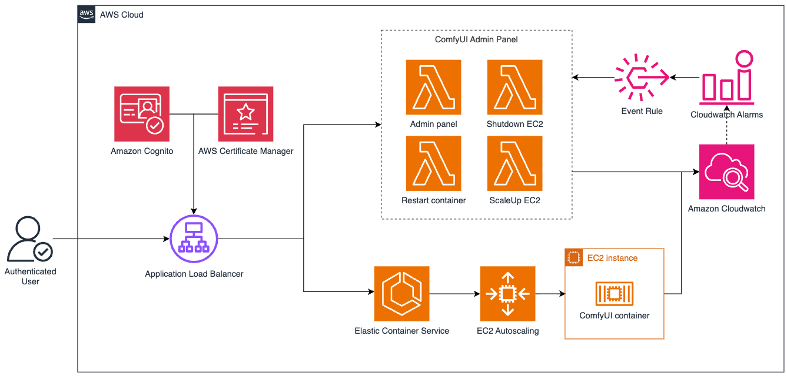

[English](./README.md) | [日本語](./README_ja.md) | 中文

# ComfyUI on AWS

[](https://opensource.org/licenses/MIT)

这个示例存储库提供了一个无缝且经济高效的解决方案,用于在AWS上部署ComfyUI,这是一个强大的基于AI的图像生成工具。该存储库提供了全面的基础设施代码和配置设置,利用了ECS、EC2和其他AWS服务的功能。体验无忧的部署过程,同时享受无可妥协的安全性和可扩展性。

💡 注意:这个解决方案会产生AWS成本。您可以在成本部分找到更多相关信息。


## 解决方案特点

1. **轻松部署** 🚀: 利用 [云开发工具包 (CDK)](https://aws.amazon.com/cdk/) 实现简化和自动化的部署过程。
2. **成本优化** 💰: 利用抢占式实例、自动关机和定时扩缩容等成本节省选项来提高预算效率。
3. **强大的安全性** 🔒: 享受包括身份验证 (使用 SAML 如 Microsoft Entra ID / Google Workspace)、电子邮件域限制、IP 限制、自定义域 SSL、安全扫描等在内的强大安全措施带来的安心。

## 架构概述



## 服务

- **[Amazon VPC](https://docs.aws.amazon.com/zh_cn/vpc/latest/userguide/what-is-amazon-vpc.html)** - 创建一个具有公有和私有子网的 VPC 来托管 ECS 集群
- **[ECS 集群](https://docs.aws.amazon.com/zh_cn/AmazonECS/latest/developerguide/clusters.html)** - 创建一个 ECS 集群来运行 ComfyUI 任务
- **[Auto Scaling Group](https://docs.aws.amazon.com/zh_cn/autoscaling/ec2/userguide/auto-scaling-groups.html)** - 创建一个 ASG 并将其与 ECS 关联为容量提供程序。它启动 GPU 实例来托管 ECS 任务。
- **[ECS 任务定义](https://docs.aws.amazon.com/zh_cn/AmazonECS/latest/developerguide/task_definitions.html)** - 定义 ComfyUI 容器并挂载 EBS 卷以实现持久性
- **[ECS 服务](https://docs.aws.amazon.com/zh_cn/AmazonECS/latest/developerguide/ecs_services.html)** - 创建一个 ECS 服务来运行 ComfyUI 任务定义
- **[Application Load Balancer](https://docs.aws.amazon.com/zh_cn/elasticloadbalancing/latest/application/introduction.html)** - 设置一个 ALB 来路由流量到 ECS 服务
- **[Amazon ECR](https://docs.aws.amazon.com/zh_cn/AmazonECR/latest/userguide/what-is-ecr.html)** - 存储 ComfyUI Docker 镜像
- **[CloudWatch Log Group](https://docs.aws.amazon.com/zh_cn/AmazonCloudWatch/latest/logs/Working-with-log-groups-and-streams.html)** - 存储 ECS 任务的日志
- **[Amazon Cognito](https://docs.aws.amazon.com/zh_cn/cognito/latest/developerguide/cognito-user-identity-pools.html)** - 用户目录,用于在 ALB 前进行身份验证
- **[AWS WAF](https://docs.aws.amazon.com/zh_cn/waf/latest/developerguide/waf-chapter.html)** - 通过 IP 阻止访问
- **[AWS Lambda](https://docs.aws.amazon.com/zh_cn/lambda/)** - 用于管理 ComfyUI 状态

## 入门

### 准备 AWS 环境

为了确保可重复性和一致性,我们建议使用 [Amazon SageMaker Studio Code Editor](https://docs.aws.amazon.com/sagemaker/latest/dg/code-editor.html) 来部署和测试此解决方案。

ℹ️ 您也可以使用本地开发环境,但需要确保正确配置了 AWS CLI、AWS CDK 和 Docker。

<details>
<summary>在 Amazon SageMaker Studio Code Editor 中设置环境 (点击展开)</summary>

1. 使用 [sagemaker-studio-code-editor-template](https://github.com/aws-samples/sagemaker-studio-code-editor-template/) 链接的 CloudFormation 模板启动 Amazon SageMaker Studio Code Editor(此模板包含启动 Code Editor 所需的 Docker、自动终止等功能)。
2. 使用 CloudFormation 输出中的 URL 打开 SageMaker Studio。
3. 从左上角的应用程序部分切换到 Code Editor。
</details>

<details>
<summary>在本地环境中设置环境 (点击展开)</summary>

如果没有 AWS CLI,请按照 [AWS CLI 安装指南](https://docs.aws.amazon.com/cli/latest/userguide/getting-started-install.html) 进行安装。

如果没有 CDK,请按照 [CDK 入门指南](https://docs.aws.amazon.com/cdk/v2/guide/getting_started.html) 进行安装。

如果没有 Docker,请按照 [Docker 安装指南](https://docs.docker.com/engine/install/) 进行安装。

在安装完成后,如果您还没有设置 AWS CLI,请在本地环境中运行以下命令:

```bash
aws configure
```

出现提示时,输入您的 AWS 访问密钥 ID、秘密访问密钥和默认区域名称(例如 us-east-1)。输出格式字段可以保留默认值,也可以根据需要指定。
</details>

> [!NOTE]
> 请确保您的账户有 GPU 实例配额。导航到 [Service Quota](https://us-west-2.console.aws.amazon.com/servicequotas/home/services/ec2/quotas/L-3819A6DF),并将 `All G and VT Spot Instance Requests` 设置为 4 或更高。

### ComfyUI 部署

1. (仅限首次) 克隆此存储库 (`git clone https://github.com/aws-samples/cost-effective-aws-deployment-of-comfyui.git`)
2. (仅限首次) 切换到存储库目录 (`cd cost-effective-aws-deployment-of-comfyui`)
3. 运行 `make` 进行部署

根据 Dockerfile 中的自定义节点和扩展,ComfyUI 可能需要 8-10 分钟才能准备就绪。

`ComfyUIStack.Endpoint` 输出值可用于访问应用程序。

### 模型上传

1. 您可以使用 ComfyUI-Manager 或其他扩展功能(自定义节点)来安装模型、Lora、嵌入式和 ControlNet。有关详细信息,请参阅[用户指南](docs/USER_GUIDE.md#model-installation)。
2. (可选)您可以扩展并运行此存储库的上传脚本,以安装预选的模型、ControlNet 等。如果 SSM 命令无法正常工作,请确保您使用的角色具有访问 EC2 的权限。`/scripts/upload_models.sh` 文件中有其他示例。

```bash
# 1. 使用 SSM 连接 EC2
aws ssm start-session --target "$(aws ec2 describe-instances --filters "Name=tag:Name,Values=ComfyUIStack/Host" "Name=instance-state-name,Values=running" --query 'Reservations[].Instances[].[InstanceId]' --output text)" --region $AWS_DEFAULT_REGION

# 2. 通过 SSH 连接容器
container_id=$(sudo docker container ls --format '{{.ID}} {{.Image}}' | grep 'comfyui:latest$' | awk '{print $1}')
sudo docker exec -it $container_id /bin/bash

# 3. 安装所需的模型、lora、controlnet 等(也可以将所有内容包含在脚本中一起执行)

# 人脸替换用上采样器的示例 - https://huggingface.co/ai-forever/Real-ESRGAN
wget -c https://huggingface.co/ai-forever/Real-ESRGAN/blob/main/RealESRGAN_x2.pth -P ./models/upscale_models/
```

### 访问 ComfyUI

部署的解决方案通过 Application Load Balancer 提供可访问的 EC2。Load Balancer 需要通过 Amazon Cognito User Pool 进行身份验证。

您可以启用 [Self Signup](docs/DEPLOY_OPTION.md#enable-self-sign-up)、启用 [SAML 身份验证](docs/DEPLOY_OPTION.md#saml-authentication)，或在 Cognito 控制台手动创建用户。

### 用户指南

要充分利用 ComfyUI 的功能并确保无缝体验,请查看详细的[用户指南](docs/USER_GUIDE.md)。该指南涵盖从安装到高级配置的所有步骤,帮助您轻松利用 AI 驱动的图像生成功能。

- [安装扩展(自定义节点)](docs/USER_GUIDE.md#installing-extensions-custom-nodes)
    - [推荐的扩展](docs/USER_GUIDE.md#recommended-extensions)
        - [ComfyUI Workspace Manager](docs/USER_GUIDE.md#comfyui-workspace-manager)
- [安装模型](docs/USER_GUIDE.md#installing-models)
    - [使用 ComfyUI-Manager](docs/USER_GUIDE.md#using-comfyui-manager)
    - [使用其他扩展](docs/USER_GUIDE.md#using-other-extensions)
    - [手动安装](docs/USER_GUIDE.md#manual-installation)
- [运行工作流](docs/USER_GUIDE.md#running-a-workflow)

### 部署选项

全面的部署选项使您能够创建完全符合安全性要求和预算限制的解决方案。它在 AWS 上提供了最大限度利用 ComfyUI 功能的灵活性和控制力。您可以在几个步骤内启用以下功能:

- [配置方法](docs/DEPLOY_OPTION.md#configuration-method)
    - [如何更改 cdk.json 中的值](docs/DEPLOY_OPTION.md#how-to-change-values-in-cdkjson)
- [安全相关设置](docs/DEPLOY_OPTION.md#security-related-settings)
    - [启用自我注册](docs/DEPLOY_OPTION.md#enable-self-sign-up)
    - [启用 MFA](docs/DEPLOY_OPTION.md#enable-mfa)
    - [限制可注册的电子邮件地址域](docs/DEPLOY_OPTION.md#restrict-the-email-address-domains-that-can-sign-up)
    - [启用 AWS WAF 限制](docs/DEPLOY_OPTION.md#enable-aws-waf-restrictions)
        - [IP 地址限制](docs/DEPLOY_OPTION.md#ip-address-restrictions)
    - [SAML 身份验证](docs/DEPLOY_OPTION.md#saml-authentication)
- [成本相关设置](docs/DEPLOY_OPTION.md#cost-related-settings)
    - [Spot 实例](docs/DEPLOY_OPTION.md#spot-instance)
    - [自动/定期缩容](docs/DEPLOY_OPTION.md#scale-down-automatically--on-schedule)
    - [使用 NAT 实例而不是 NAT 网关](docs/DEPLOY_OPTION.md#use-nat-insatnce-instead-of-nat-gateway)
- [使用自定义域名](docs/DEPLOY_OPTION.md#using-a-custom-domain)


### 删除部署并清理资源

为了防止误删除数据并尽可能简单,完全的部署和资源删除是半自动化的。要清理并删除所有已部署的内容,需要执行以下步骤:

1. 手动删除Auto Scaling Group:
- 登录AWS控制台
- 在搜索栏中搜索Auto Scaling Groups (EC2功能)
- 选择ComfyASG
- 点击操作并选择删除
- 确认删除

2. 删除ASG后,在终端运行以下命令将删除除EBS和Cognito User Pool之外的所有剩余资源。
```bash
npx cdk destroy
```

3. 删除EBS卷
- 登录AWS控制台
- 在搜索栏中搜索Volumes (EC2功能)
- 选择ComfyUIVolume
- 点击操作并选择删除
- 确认删除

4. 删除Cognito User Pool
- 登录AWS控制台
- 在搜索栏中搜索Cognito
- 选择ComfyUIuserPool..
- 点击删除
- 确认删除

5. 删除ECR存储库
- 登录AWS控制台
- 在搜索栏中搜索ECR (Elastic Container Registry)
- 选择comfyui
- 点击删除
- 输入delete并确认删除

## 备忘录和补充信息

### 成本估算

本节提供在 AWS 上运行此应用程序的成本估算。这些是概略性的,需要根据项目的具体要求和使用模式进行调整。

#### 灵活的工作负载(默认)

对于业务上不太重要的工作负载,大多数应用程序都属于这种类型,您可以利用使用spot实例来获得成本优惠。spot实例在 `g4dn.xlarge` 实例类型上提供平均 71% (us-east-1, 2024年10月)的折扣。此外,您还可以将NAT网关替换为NAT实例,进一步降低成本。

成本估算的前提条件如下:

- 不包括 AWS 免费层服务。
- 实例类型: `g4dn.xlarge` (4 vCPU, 16 GiB 内存, 1 个 Nvidia T4 Tensor Core GPU), spot实例 (71% 折扣)。
- 250 GB SSD 存储。
- 1 个 Application Load Balancer。
- 带有 NAT 实例的 VPC。
- 每月 10 GB 的 Elastic Container Registry (ECR) 存储数据。
- 每月 5 GB 的日志数据。

| 服务 \ 运行时间 | 工作日 2 小时/天 | 工作日 8 小时/天 | 工作日 12 小时/天 | 24 小时 /7 天 |
|---------------|----------------|----------------|-----------------|--------------|
| 计算           | $7             | $26            | $40             | $111         |
| 存储           | -              | -              | -               | $20          |
| ALB           | -              | -              | -               | $20          |
| 网络           | -              | -              | -               | $6           |
| 注册表         | -              | -              | -               | $1           |
| 日志           | -              | -              | -               | $3           |
| 月总计         | $60            | $79            | $93             | $164         |

#### 重要的业务工作负载

对于业务上重要的工作负载,可以使用按需实例和 NAT 网关来提高可用性。

成本估算的前提条件如下:

- 实例类型: `g4dn.xlarge`(4 vCPU、16 GiB 内存、1 个 Nvidia T4 Tensor Core GPU),按需定价。
- 每月通过 NAT 网关处理 50 GB 数据。
- 其他前提条件与灵活工作负载场景相同。

| 服务 \ 运行时间 | 工作日 2 小时/天 | 工作日 8 小时/天 | 工作日 12 小时/天 | 全天 24 小时/7 天 |
|---------------|----------------|----------------|-----------------|-----------------|
| 计算           | $23            | $91           | $137            | $384             |
| 存储           | -              | -             | -               | $20              |
| ALB           | -              | -             | -               | $20              |
| 网络           | -              | -             | -               | $70              |
| 注册表         | -              | -             | -               | $1               |
| 日志           | -              | -             | -               | $3               |
| 月总计         | $137           | $205          | $251            | $498             |

### CDK 便利的命令

* `npx run cdk ls`          列出应用程序中的所有堆栈
* `npx run cdk synth`       输出合成的 CloudFormation 模板
* `npx run cdk deploy`      将此堆栈部署到默认的 AWS 帐户/区域
* `npx run cdk destroy`     从默认的 AWS 帐户/区域中删除已部署的堆栈
* `npx run cdk diff`        比较已部署的堆栈与当前状态
* `npx run cdk docs`        打开 CDK 文档

## 问答

#### Dockerfile 中是否预先安装了模型?

Dockerfile 中只包含 ComfyUI 和 ComfyUI-Manager。要安装模型,需要在部署后使用 ComfyUI-Manager,或参考[上传模型](README.md#uploading-models)部分。

#### 我可以为这个项目做贡献吗?

是的,请按照[CONTRIBUTING](CONTRIBUTING.md#security-issue-notifications)中的说明进行。

#### 可以用于生产环境部署吗?

这个配置是为个人使用或非生产环境的示例部署而设计的。

## 贡献者

[](https://github.com/aws-samples/cost-effective-aws-deployment-of-comfyui/graphs/contributors)

## 安全性

有关详细信息,请参阅 [CONTRIBUTING](CONTRIBUTING.md#security-issue-notifications)。

## 许可证

该库在 MIT-0 许可下发布。请参阅 LICENSE 文件。

- [License](LICENSE) of the project.
- [Code of Conduct](CONTRIBUTING.md#code-of-conduct) of the project.
- [THIRD-PARTY](THIRD-PARTY) for more information about third party usage
