# SAML with Microsoft Entra ID

This is a reference guide for integrating with Microsoft Entra ID (formerly Azure Active Directory) and SAML. Please modify the detailed parameters to suit your environment.

## Prerequisites

We will perform the initial deployment of this solution. After the initial deployment, we will integrate Cognito with Entra ID using SAML.

From the Output tab, note down the Cognito User Pool ID and Cognito Domain Name.

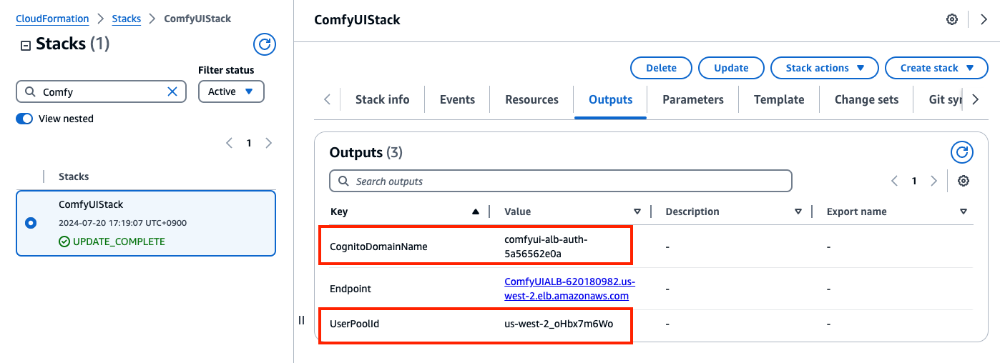


## Setting up Microsoft Entra ID

Enable SAML integration with Microsoft Entra ID (formerly Azure Active Directory).

Open the Microsoft Entra ID configuration screen from Microsoft Azure.

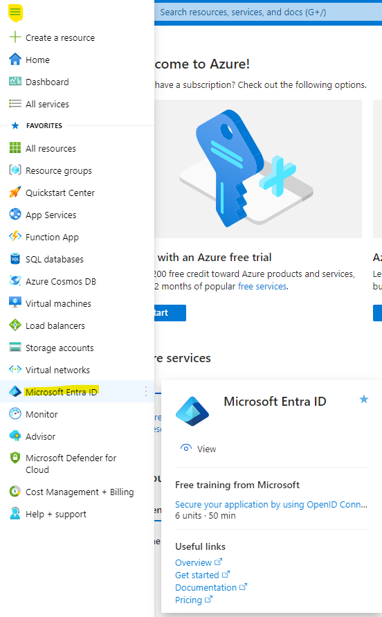

Select *Enterprise Applications*.


Select *New application*.

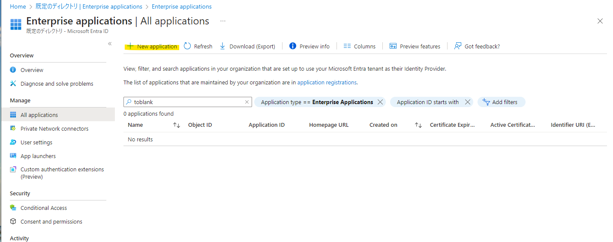

Select *Create your own application*


Enter any application name and click Create. In this example, we use 'ComfyUI'.

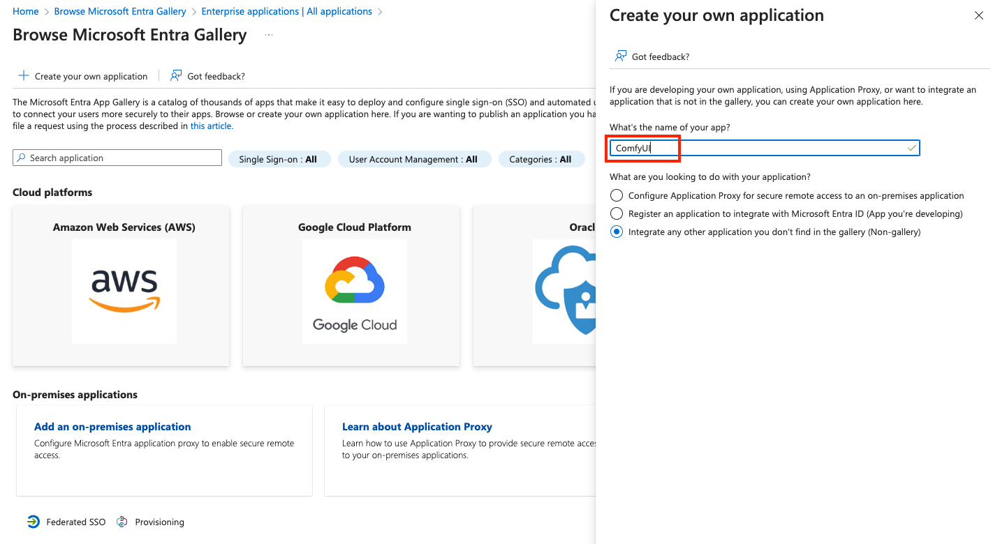

From the Single sign-on menu, select *SAML*.


Click *Edit* in Basic SAML Configuration.


Enter the following parameters and click Save. Use the Cognito user pool ID and Cognito Domain Name you confirmed in [Prerequisites](#Prerequisites).

Identifier (Entity ID) 

```
# Format
urn:amazon:cognito:sp:<UserPoolID>

# Example
urn:amazon:cognito:sp:us-west-2_oHbx7m6Wo
```

Reply URL (Assertion Consumer Service URL)

```
# Format
https://<cognito domain name>.auth.yourRegion.amazoncognito.com/saml2/idpresponse

# Example
https://your-preferred-name.auth.ap-northeast-1.amazoncognito.com/saml2/idpresponse
```

Specify a value and click Save.

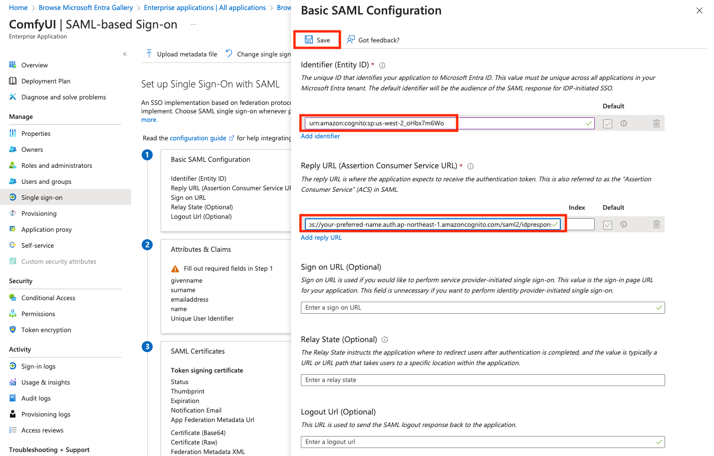

The settings have been applied.

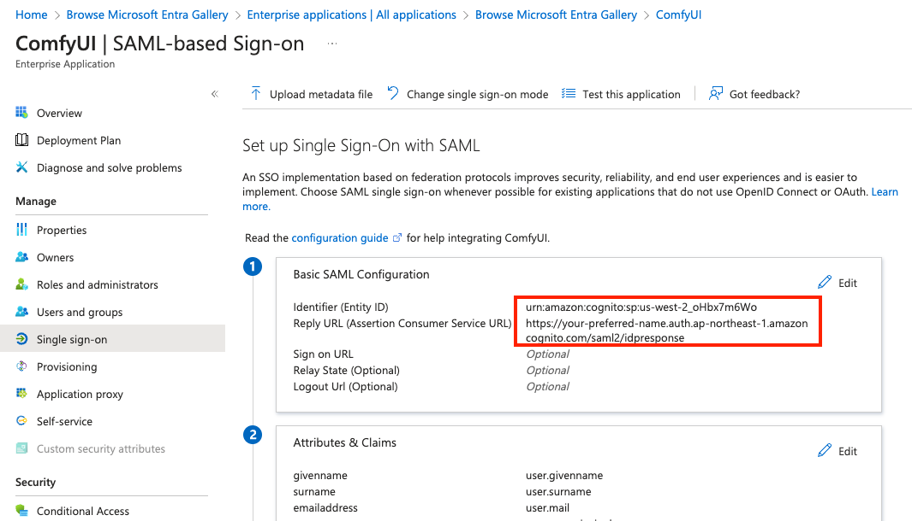

Select *Download* for Federation Metadata XML to obtain the XML file.

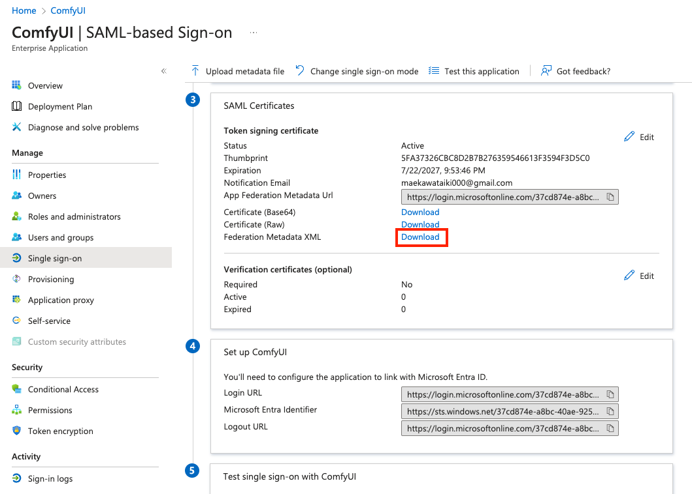

Add users or groups to associate with this application. Only the associated users or groups can log in here.

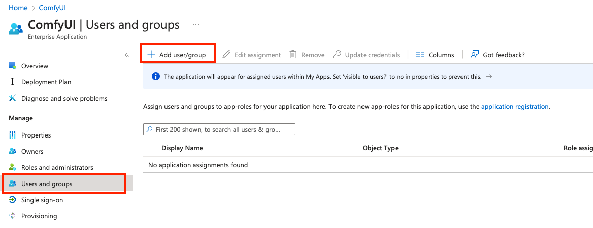

In this example, we specify a user that was created in advance. Please specify according to your environment.

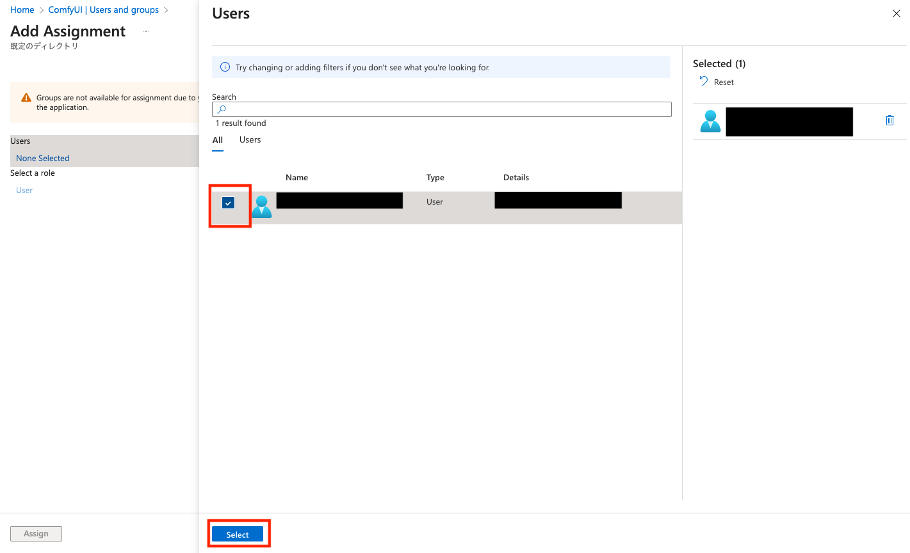

Click Assign.


## Cognito Configuration: Federation

Return to the Cognito  in the AWS Management Console.
Open the Cognito User Pool screen, and from the Sign-in experience tab, select Add identity provider.


To use SAML for integration with Entra ID, select SAML.


Enter any easily identifiable name for Provider name.
Select Choose file and upload the "Federation Metadata XML" downloaded from Entra ID.

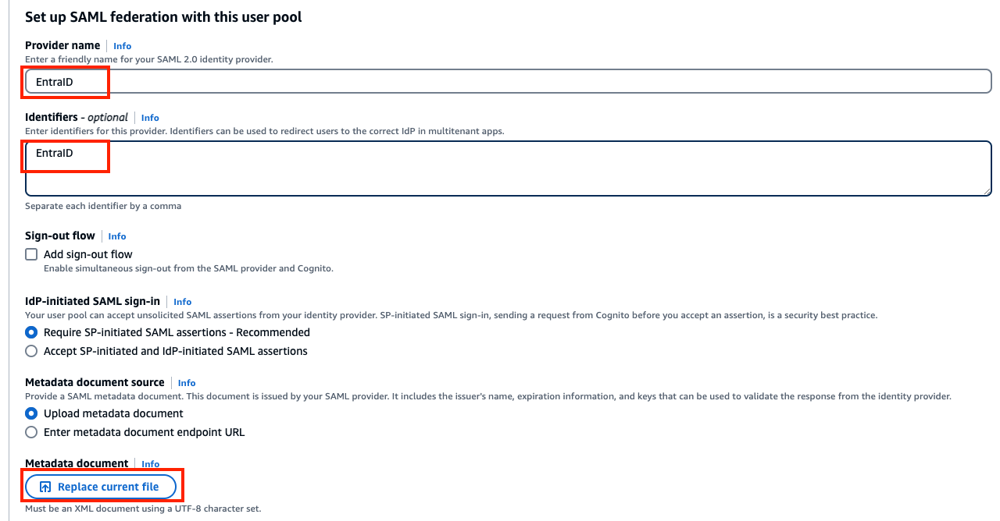

For the User pool attribute, specify email, surname and givenname.
For the SAML attribute, select the following string and choose Add identity provider:

```
http://schemas.xmlsoap.org/ws/2005/05/identity/claims/emailaddress
http://schemas.xmlsoap.org/ws/2005/05/identity/claims/givenname
http://schemas.xmlsoap.org/ws/2005/05/identity/claims/surname
```

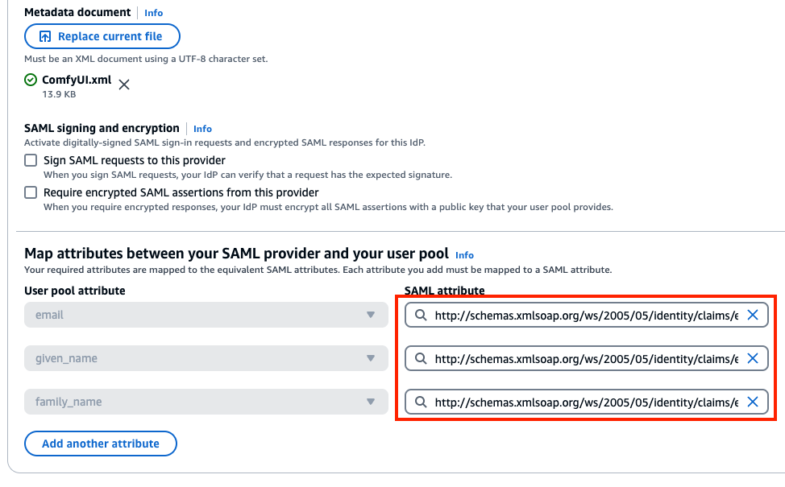

A new setting has been added.


## Configuring Cognito: Hosted UI

We will configure the settings to use the added Entra ID integration with the Hosted UI. Select the App Integration tab.


Specify an existing App Client.


Press Edit.


Select EntraID as the Identity Provider. Also, uncheck the Cognito user pool checkbox as you want to stop authentication using the Cognito user pool.


Select Save changes.

## Editing `parameter.ts`

Since the configuration is now complete, we will change the values in parameter.ts.

- samlAuthEnabled: Set to `true`. This will switch to the SAML-only authentication screen, and the conventional authentication function using Cognito user pools will no longer be available.

```typescript
export const overrideParameter: Partial<ComfyUIStackProps> = {
  ...
  samlAuthEnabled: true,
  ...
};
```

After configuration, redeploying will enable SAML integration.
